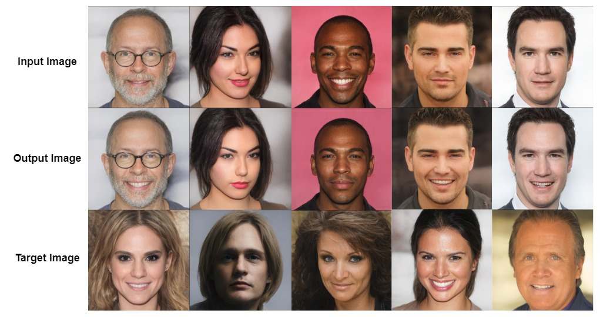
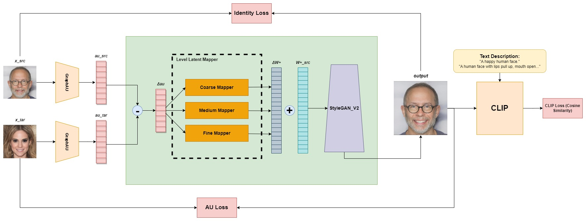
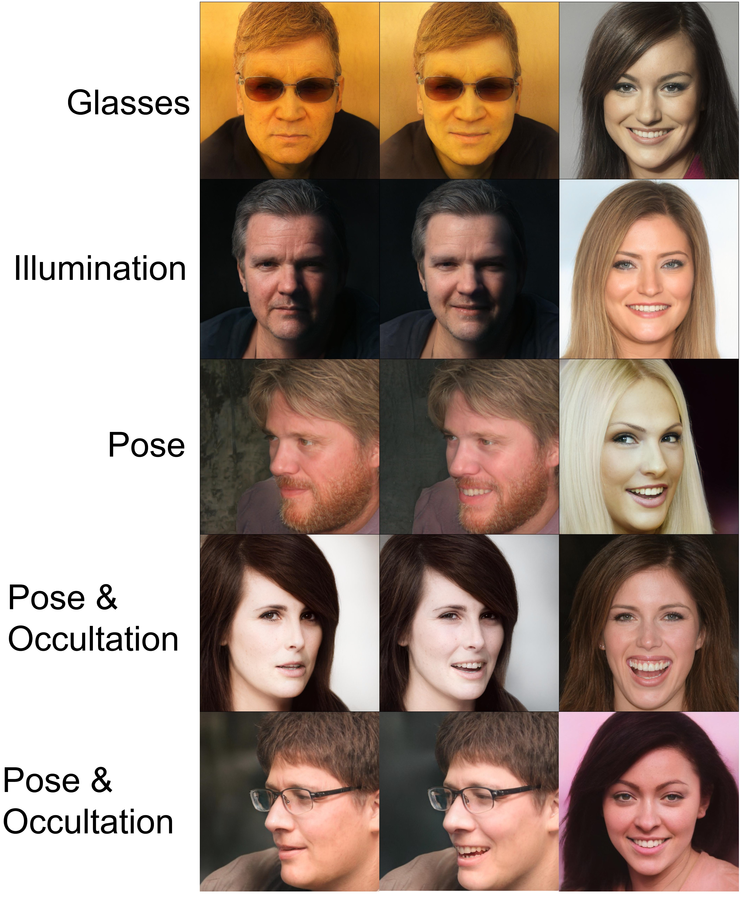

# AU-CLIP: A Facial Expression Editing Method based on Action Unit

This is the code for project of Jiawei Li (u6988392).



>**Abstract:** Over the past decade, the evolution of Generative Adversarial Networks has 
> placed image synthesis and editing at the forefront of research. The manipulation of facial images, 
> in particular, has garnered significant attention due to its potential to revolutionize various 
> entertainment industries such as film and social media. One particular area of focus has been the 
> translation and editing of human facial expressions, often requiring precise control of each facial 
> feature (movement of eyebrows, lips, wrinkles, etc.)  to better meet user needs. 
> Existing methods for facial expression translation or editing normally demand extensive manual 
> annotations for training data, paired images, or reliance on some form of 3D prior information to 
> allow the model to learn differences between distinct facial expressions. Moreover, the style 
> of generated facial images is typically constrained by the domain of the training data, 
> which limits flexibility. In this paper, we introduce a simple and effective method for facial editing. 
> More specifically, we utilize a set of action unit vectors to quantitatively represent the state of 
> each facial feature under different expressions. 
> Concurrently, by incorporating the increment of expression characteristics (action unit vectors), 
> the model is able to learn the mapping between the variation in a specific channel within the 
> feature space (action unit vectors) and the associated change in a particular facial element. 
> Moreover, the powerful image-language model CLIP is leveraged as a loss function along with simple 
> prompt engineering to optimize the linear mapper. Through a series of quantitative and quantitative 
> evaluations, our model is capable of generating high-resolution facial images with desired 
> modification in facial expression under varying angles and lighting conditions, which is accomplished 
> solely by providing the action unit vector of a desired facial expression.

## Network Architecture


## Environment Setup
For our method, it is required to have:
- Anaconda
- [CLIP](https://github.com/openai/CLIP)

To install CLIP please run the following commands:
```shell script
conda install --yes -c pytorch pytorch=1.7.1 torchvision cudatoolkit=<CUDA_VERSION>
pip install ftfy regex tqdm gdown
pip install git+https://github.com/openai/CLIP.git
```

- We adopt a StyleGAN2 generator pretrained on FFHQ dataset. To download the pretrained weight, the link is
[here](https://drive.google.com/file/d/1EM87UquaoQmk17Q8d5kYIAHqu0dkYqdT/view?usp=sharing). The pretrained weight 
should be directly placed at the root directory of this project.

- Also, in order to calculate the ID loss, we adopt a pretrained ArcFace network, the pretrained weight can be manually
downloaded [here](https://drive.google.com/file/d/1KW7bjndL3QG3sxBbZxreGHigcCCpsDgn/view?usp=sharing). Place it at the
root directory as well.


## Data Preparation

### Dataset
- The dataset we adopt is CelebA-HQ. To make this method computationally friendly,
our model is trained on latent vectors, where train set and test set are extracted from a pretrained 
GAN inversion model [e4e](https://github.com/omertov/encoder4editing).
Links to download [train set](https://drive.google.com/file/d/1gof8kYc_gDLUT4wQlmUdAtPnQIlCO26q/view)
and [test set](https://drive.google.com/file/d/1j7RIfmrCoisxx3t-r-KC02Qc8barBecr/view).
  
Place these two .pt files into root directory.

### Auxiliary Data
- Place original [train images](https://drive.google.com/file/d/1h9G7vg-5QyYGIOPt0ymFYfzxF8YT0fFm/view?usp=sharing) and [test images](https://drive.google.com/file/d/188j9omYpRWmtb5VwlNBphNzD3FvCjruA/view?usp=sharing) into `./mapper/training`.

- The action unit vector for [train set](https://drive.google.com/file/d/17OirqDdeE8neU7cJYGJKjTbWYCnqm_5Q/view?usp=sharing) and [test set](https://drive.google.com/file/d/1NvtXZJEvikQkXTHn_svAoc14mPwlQf3T/view?usp=sharing) extracted via [GraphAU](https://github.com/CVI-SZU/ME-GraphAU/tree/main) should be placed into `./mapper/training`.

- `truncated_index.csv`([link](https://drive.google.com/file/d/1odfxHFvNIhmXq5vG0uH6YQPitC1abIS2/view?usp=drive_link)) is a list recording the index of selected images to make the train set balanced in
facial expression categories, which is achieved via a facial expression classification network -- [RMN](https://github.com/phamquiluan/ResidualMaskingNetwork). Manually download it and place it into `./mapper`.

## Train
- Before training, user needs to manually download script of [graphyAU](https://drive.google.com/file/d/18PxsA8lMG0TO5HiQMkI9-xKRoXHNhaz5/view?usp=sharing) and its [pretrained weights](https://drive.google.com/file/d/1wQdNJMa0jV4_5n-jVoTiqPXT2kE6Rh7m/view?usp=sharing). Put them all into `./utils`.

- To set the train options, please refer to `./mapper/options/train_options.py`.

Please check the path of corresponding variable as mentioned above.

For the best model, the options is set as the default values in train_options.py.

## Inference

The scripts for different type of inference and metric calculation are in `./mapper/inference`.

Please check the path in option file, and run the script directly.

The pretrained weights of our best model can be downloaded [here](https://drive.google.com/file/d/1D-r9HjfgqKoaTTiLv65H1avM6ckZi4lG/view?usp=sharing).

Place it under any directories, and modify the path in corresponding option files.

## Result Visualization

### facial expression translation result


### face animation
.jpg)

### challenging scenarios


## Acknowledgement
- Our code is highly inspired by [StyleCLIP](https://github.com/orpatashnik/StyleCLIP).
- We use pretrained GAN inversion model [e4e](https://github.com/omertov/encoder4editing) to get the w+ code
of original image.
  
- We use pretrained action unit regression network -- [ME-GraphAU](https://github.com/CVI-SZU/ME-GraphAU/tree/main) to extract action unit values.
    